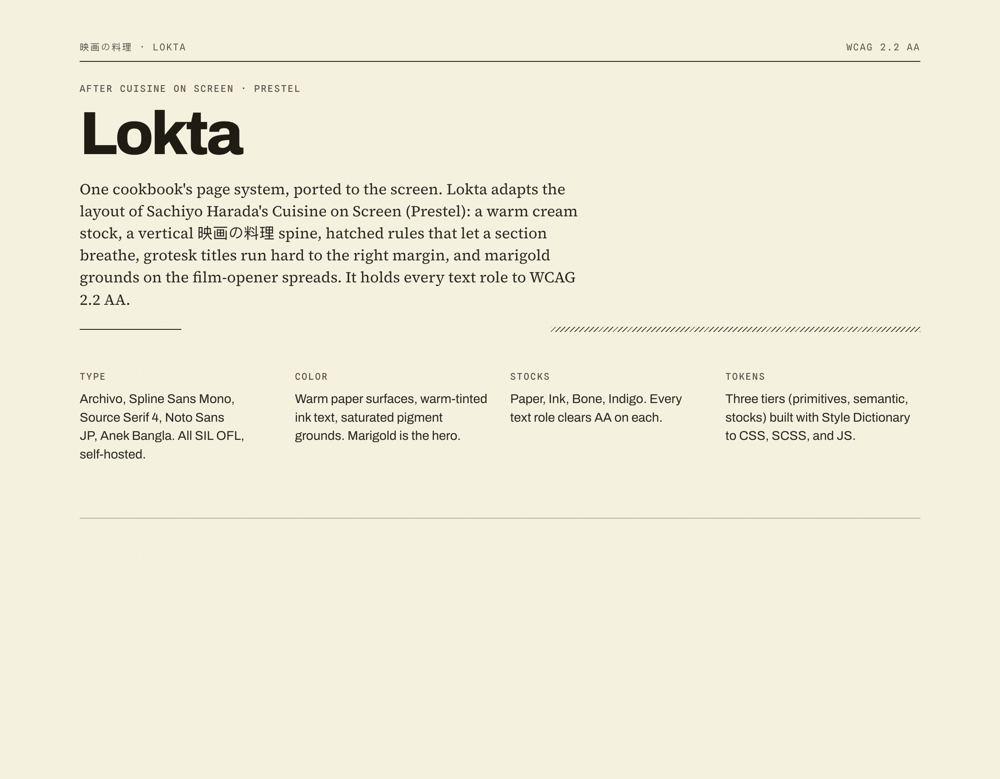
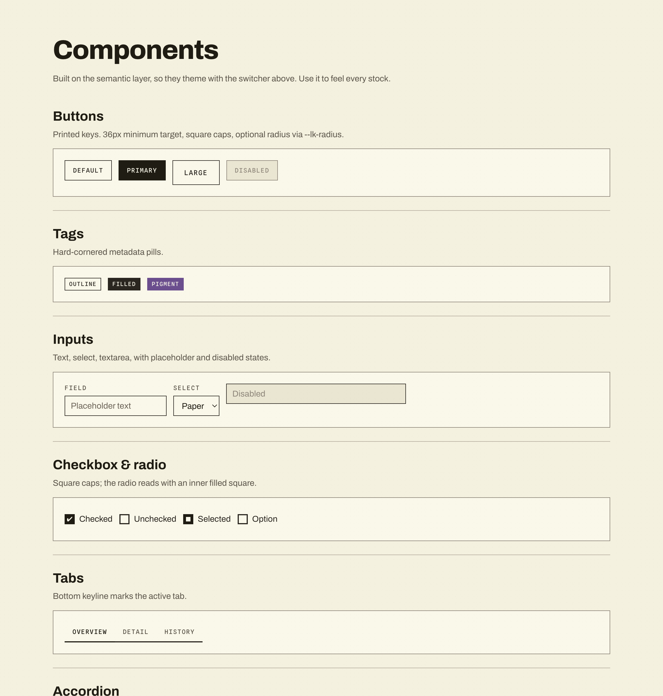
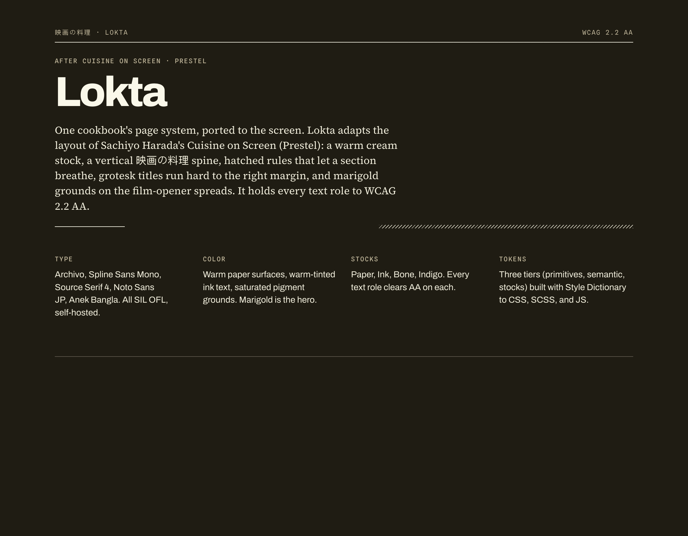

# lokta-css

The web layer of the [Lokta](https://github.com/msradam/lokta) design system:
design tokens for four paper stocks and a component layer built on them. Editorial
and flat, layering comes from borders and surface tokens, not shadows. Hard-edged:
square caps, no rounded controls by default. Every text role clears WCAG 2.2 AA on
its surface, in every stock. Fonts are self-hosted (SIL OFL), no Google Fonts CDN.





The same components on the Ink stock:



## Install

From GitHub, no registry needed:

```bash
npm install github:msradam/lokta-css
```

```css
@import "lokta-css/lokta.css";
```

Or zero install, straight from the CDN:

```html
<link rel="stylesheet" href="https://cdn.jsdelivr.net/gh/msradam/lokta-css@main/lokta.css">
```

Light install (one file, central location):

```bash
mkdir -p ~/.lokta
curl -sL https://raw.githubusercontent.com/msradam/lokta-css/main/lokta.css -o ~/.lokta/lokta.css
# (the @import paths resolve against the repo on a CDN; for a single local file,
#  use the CDN link above or vendor the whole folder)
```

## Use

`lokta.css` pulls in the tokens (all four stocks), the fonts, the base layer, and
the components. Set the stock with `data-theme` on the root element. Paper is the
default.

```html
<html data-theme="ink">
  <body class="lk">
    <button class="lk-btn lk-btn-primary">Action</button>
    <span class="lk-tag lk-tag-pigment">Pigment</span>
    <span class="lk-status lk-status-done">Done</span>
  </body>
</html>
```

Build UI against the semantic layer (`--text-primary`, `--surface-page`,
`--border-strong`, `--accent-success`) so theming and accessibility are inherited.
Never consume primitives (`--ink-90`, `--paper-01`) directly in product UI.

Load only what you need:

```css
@import "lokta-css/lokta.paper.css"; /* one stock */
@import "lokta-css/components";      /* just the .lk-* classes */
```

## Stocks

| Stock | `data-theme` | Tone |
| --- | --- | --- |
| Paper | `paper` (default) | warm cream, light |
| Ink | `ink` | warm dark |
| Bone | `bone` | cool near-white |
| Indigo | `indigo` | cool dark |

## Components

`lk-btn` (and `-primary`, `-lg`), `lk-tag` (`-filled`, `-pigment`), `lk-input` /
`lk-select` / `lk-textarea`, `lk-check`, `lk-radio`, `lk-tabs` / `lk-tab`,
`lk-accordion`, `lk-note` (`-success`, `-danger`, `-info`), `lk-breadcrumb`,
`lk-pagination` / `lk-page`, `lk-progress`, `lk-slider`, `lk-tooltip`, `lk-code`,
`lk-table`, `lk-modal`, the editorial marks (`lk-rule`, `lk-measure`, `lk-endmark`),
and the page furniture (`lk-running-head`, `lk-colophon`, `lk-folio`).

## Brand customisation

Apps may override the brand layer. Everything else (type scale, 8px grid, AA
rules, hard-edged character) is locked.

| Knob | How | Default |
| --- | --- | --- |
| Accent pigment | `--lk-accent` | marigold |
| Control radius | `--lk-radius` (0 to 3px) | `0px` |
| Density | `data-density="compact"` | comfortable |
| Grain | `data-grain="off"` | on |
| Stock | `data-theme` | paper |

`forced-colors: active` (Windows High Contrast) and `prefers-reduced-motion` are
supported.

## License

MIT. Fonts are SIL OFL. Part of the [Lokta](https://github.com/msradam/lokta)
design system, drawn from the cookbook *Cuisine on Screen* (Sachiyo Harada,
Prestel) and Professor Siddika Kabir's *Ranna Khaddo Pushti*.
